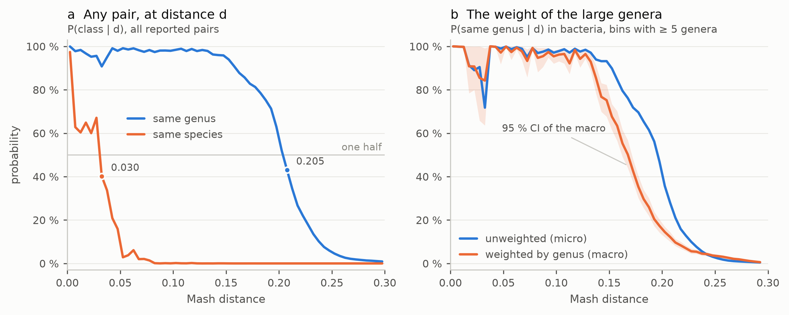
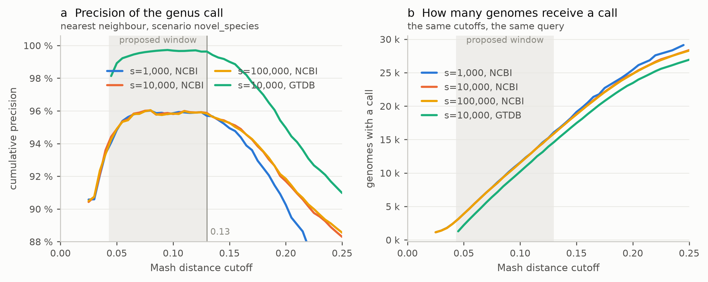
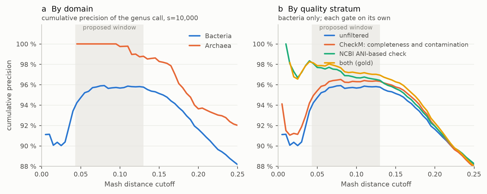
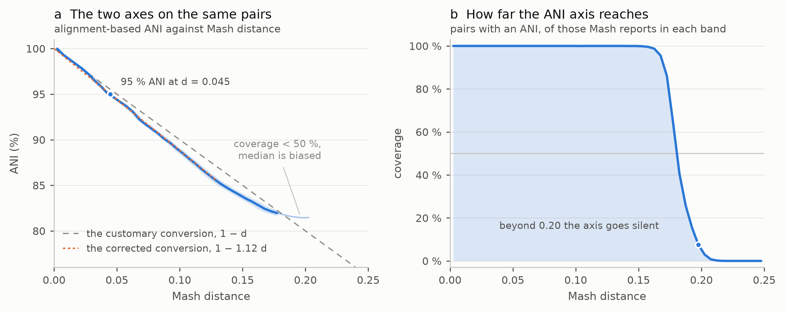
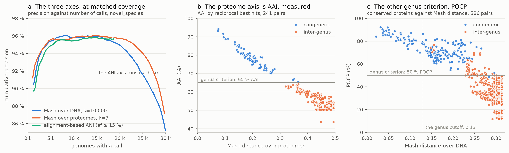
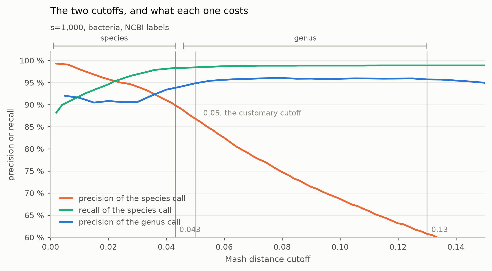
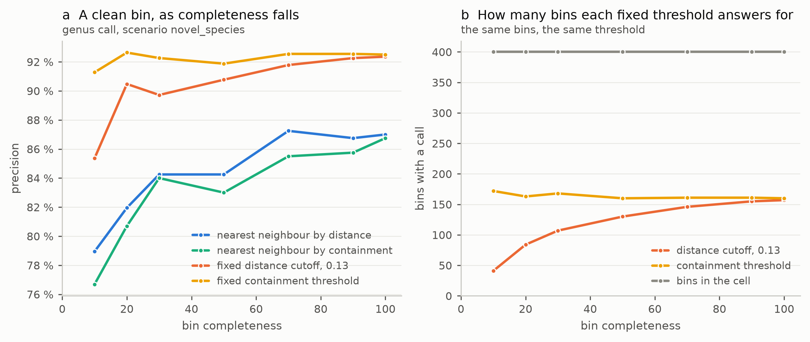

# Tighten the species, and stop guessing the genus: both Mash distance boundaries measured over every pair of prokaryotic type material

Karel Estrada^1^ and Ayixon Sánchez-Reyes^2,\*^

^1^Unidad Universitaria de Secuenciación Masiva y Bioinformática, Instituto de
Biotecnología, Universidad Nacional Autónoma de México, Av. Universidad 2001, Chamilpa,
62210 Cuernavaca, Morelos, México.

^2^Investigador por México — Instituto de Biotecnología, Universidad Nacional Autónoma de
México, Av. Universidad 2001, Chamilpa, 62210 Cuernavaca, Morelos, México.

\*To whom correspondence should be addressed. E-mail: ayixon.sanchez@ibt.unam.mx

**[Nota — faltan los ORCID de los dos autores.]**

---

## Abstract

Genomic pipelines routinely convert Mash distances into taxonomic assignments using
thresholds calibrated on limited or computationally predicted datasets. Here, we empirically
delimit the species and genus boundaries across the entirety of prokaryotic type material:
30,209 genomes comprising 4.56 × 10^8^ pairwise comparisons. We establish strict, actionable
thresholds: species at d ≤ 0.043 and genus at 0.043 < d ≤ 0.13. These measurements
demonstrate that current standards are fundamentally flawed. The ubiquitous conversion of
distance to identity as 1 − d is systematically biased, overstating relatedness by 12d
points. We correct this with an exact formulation (ANI = 1 − 1.12d), proving that the
customary 0.05 species cutoff is mathematically overly permissive, admitting pairs below 95%
ANI, while past 0.13 the precision plateau breaks and every additional genus call costs an
order of magnitude more. The only genus threshold previously proposed in Mash space, 0.34,
is unobservable with the 1,000-hash sketches most tools ship, whose ceiling is 0.296. We prove
the robustness of these boundaries by showing their
invariance to a hundredfold increase in sketch size — below 0.13 a thousand hashes already
suffice, and ten thousand exhaust the estimator — to taxonomy shifts (NCBI vs. GTDB), and to
algorithm substitutions (ANI and AAI proxies). Crucially for metagenomics, we show that when
querying incomplete bins, fixed distance cutoffs fail by silencing calls rather than
misclassifying them; the species boundary is consumed by incompleteness alone at 25%, while
the genus window survives down to 3.4%. Applied unchanged to an independent, ANI-based revision of the clinically important genus *Fusobacterium*, the cutoffs reproduce 176 of its 177 species reassignments and return the superseded name in none. That genus separates its own species at d = 0.049–0.054, above the proposed cutoff, so the cutoff is conservative there rather than wrong. We provide the exact formulas, cutoffs, and sketch
parameters required to stop guessing taxonomic boundaries and start measuring them.

## 1. Introduction

Alignment-free genome comparison based on MinHash sketching (Ondov et al., 2016) made
all-versus-all comparison of large genome collections routine, and Mash distance is now
widely used as a first-pass estimate of relatedness — including as the decision variable
that assigns a metagenome-assembled genome to a taxonomic neighbourhood, with sketched
reference databases assembled specifically for that purpose (Sánchez-Reyes and
Fernández-López, 2024).

Turning that distance into a rank assignment requires thresholds, and the two thresholds
in common use rest on very different foundations. The species threshold has a real anchor:
95 % average nucleotide identity is the operational boundary of the prokaryotic species
(Richter and Rosselló-Móra, 2009; Jain et al., 2018), and Mash distance is often converted
to identity as 1 − d. The genus threshold has no equivalent anchor, and cannot have one in
the form usually requested, because genus is not delimited by nucleotide identity at all:
the formal genome-based criteria are amino acid identity (~65 %) and percentage of
conserved proteins (~50 %) (Konstantinidis and Tiedje, 2005; Qin et al., 2014; Barco et al.,
2020). The closest thing to a Mash-space genus threshold comes from a study of 11,444
complete bacterial genomes reporting that 92.37 % of congeneric pairs fall between 0.05 and
0.34 (Zhu et al., 2019).

Three problems follow, and they are the subject of this work.

The first is that a Mash distance threshold is not a property of the data alone. The
distance is derived from an estimated Jaccard index over *s* sampled hashes, so the
smallest non-zero Jaccard index that a sketch can express — and therefore the largest
distance it can represent — is fixed by *s*. Published thresholds rarely travel with the
sketch size that produced them.

The second is a question of conditional probability. The claim that genomes in a given
identity band "almost always" share a genus is a statement about P(distance | same genus).
Anyone setting a cutoff needs P(same genus | distance), and the two are related through a
base rate that, in type material, is heavily unfavourable. Whether that base rate is enough
to bury the congeneric signal is an empirical question that does not appear to have been
asked at this scale.

The third is sampling. Genome collections are not uniform samples of the taxonomy: the
number of congeneric pairs a genus contributes grows with the square of the number of its
sequenced species, so a curve fitted on raw pairs is disproportionately the curve of a few
large genera.

A fourth problem is the reference collection itself. A threshold for a *rank* can only be
calibrated against labels that the rank actually stands behind, and in a collection of
complete genomes most names are inherited from whatever the depositor believed or from a
classifier's prediction. Type material is the one genome set in which every name is backed by
formal nomenclature and every genome is the nomenclatural anchor of its own species, so a
boundary fitted on it is a boundary between named ranks rather than between prior
assignments. That is why the measurement below is made on type material and nowhere else, and
it is also what makes the residual error interpretable: when a call is wrong, one of the two
names is a claim someone published, not a guess a tool made.

This work measures P(same species | d) and P(same genus | d) over every pair of the
prokaryotic type material, reports each in a pairwise and a nearest-neighbour view, weights
by genus, and repeats the measurement against a second taxonomy and against two independent
indices. The deliverable is a pair of boundaries with the conditions attached — the sketch
sizes over which they hold, the taxonomy that bounds them from either side, and the query
condition under which they stop holding.

Measuring an entire type-material collection rather than a sample of it also settles four
questions that were not the point of the exercise but stand on their own, and each is
reported where it belongs. How far the customary conversion d = 1 − ANI is from the measured
equivalence, what single coefficient corrects it, and therefore where the 95 % species
standard really falls (§3.8). How far an
alignment-based ANI axis reaches before it stops being defined, which turns out to be exactly
where the genus question becomes hard (§3.8). Whether a sketch over proteomes is amino acid
identity in more than name, and where the published ~65 % genus criterion falls once it is
measured rather than inherited (§3.9). And what a fixed cutoff does when the query is an
incomplete metagenome bin rather than a complete genome (§3.13).

## 2. Materials and Methods

### 2.1. Genome set and gold standard

The genome set is the NCBI type-material collection (Sayers et al., 2024): 30,209 assemblies
downloaded with `datasets` (`--from-type --assembly-version latest --assembly-source genbank
--exclude-atypical --mag exclude`), 29,195 bacterial and 1,014 archaeal. Type material was
chosen because it is the widest-coverage genome set whose names are backed by formal
nomenclature, and because each genome inherits its genus from that nomenclature rather than
from a prediction.

Ranks were resolved with TaxonKit v0.20.0 (Shen and Ren, 2021) against a pinned NCBI
taxonomy dump (downloaded 2026-07-10). **Ranks are taken from the taxid lineage, never by
parsing the binomial**: splitting a name on its first token fails on 89 `Candidatus X y`
names and on ~57 bracketed names such as `[Clostridium] scindens`, which are precisely the
taxonomically contested cases that dominate the tail of the distribution. All 23,359
distinct taxids resolved a full standard-rank lineage, with no genus missing and no
disagreement between the species name in the lineage and the one parsed by NCBI.

Disqualifying conditions were recorded as flags rather than applied as filters, so that
strata could be defined downstream and sensitivities measured instead of assumed: assemblies
sharing a below-species taxid (2,158; the same strain sequenced more than once, up to twelve
times), assemblies whose NCBI ANI-based taxonomy check did not return OK (609), assemblies
with CheckM completeness < 90 % or contamination > 5 % (8,440) (Parks et al., 2015), and two
conditions that turned out to be empty in this collection — no genus in the lineage, and
disagreement between the lineage and the NCBI species name. 21,345 assemblies (70.7 %) carry
none of them and form the *gold* stratum used in sensitivity analyses. Assemblies sharing a
species-level taxid are *not* flagged: 9,673 of them are distinct strains of the same
species and constitute legitimate conspecific pairs.

### 2.2. Sketching and the all-versus-all comparison

Sketches were rebuilt rather than reused. Pre-existing sketches of the same collection
contained 30,213 entries for 30,209 genomes: in two assembly directories the download had
left `*_cds_from_genomic.fna` and `*_rna_from_genomic.fna` alongside the genome, and a
sketch built by walking the file tree had taken those extracts as if they were independent
genomes. All sketching here starts from a canonical manifest that selects `*_genomic.fna`,
excludes those two suffixes, and verifies one entry per accession.

Three sketch sizes — s = 1,000, s = 10,000 and s = 100,000 — were built from the same
manifest with k = 21 and seed 42, so that sketch size is the only difference between them.
The all-versus-all comparison uses `mash triangle -E -d <cutoff>`, which walks the lower
triangle once and filters the edge list at the source; the stream is piped directly into a
single-pass accumulator, so no intermediate file holds the raw comparison. Pairs above the
cutoff are not lost: an exact pair census computed from group sizes gives the number of
pairs in every taxonomic class, so what was not reported is recovered by subtraction. The
common window is d ≤ 0.28, just below the measurable ceiling of s = 1,000; the larger
sketches were also run at d ≤ 0.40. The three runs took about 5 min, 1 h and 10 h with 16
threads and produced 11.7 M, 100.8 M and 125.6 M edges below their cutoffs.

### 2.3. Two views of the same measurement

Every curve is reported in two views, because they answer different questions and, as shown
below, do not behave the same way.

The **pairwise view** gives P(class | d) over all reported pairs. It characterizes the
metric in general and is the view that carries the base rate.

The **leave-one-out view** takes, for each genome, its nearest neighbour among the others
and asks whether that neighbour is congeneric. This is the condition a classifier actually
operates in: it does not evaluate a random pair, it evaluates the minimum over a reference
database. Three nested scenarios were computed, each removing more of the query's own
taxonomy from the database: `as_reported` (whatever the nearest neighbour is),
`no_self_strain` (replicate assemblies of the query's own strain removed) and
`novel_species` (every genome of the query's own species removed, so the best possible hit
is a different species). The genus results below use `novel_species`, which is the
out-of-domain condition a genus cutoff exists to serve; the species results use
`no_self_strain`.

### 2.4. Genus weighting

Because the pairwise contribution of a genus grows quadratically with its number of
sequenced species, every aggregate is reported both unweighted (micro) and weighted (macro):
the quantity is computed inside each genus and the genera are then averaged with equal
weight. Genera enter the macro average only above a declared minimum (5 calls in the
leave-one-out view, 20 pairs per band in the pairwise view), and the number retained is
reported alongside every estimate. The interval on the macro mean is a percentile bootstrap
of 2,000 resamples over genera; the spread across genera is given as quartiles, because
per-genus precisions are bounded and strongly skewed.

### 2.5. A second taxonomy

The same distances were relabelled with GTDB r232 (Parks et al., 2022) and the entire
leave-one-out analysis recomputed, changing nothing but the labels. GTDB indexes genomes by
RefSeq accession where one exists, so the paired accession from the NCBI assembly report
resolves most lookups: 28,357 matches by RefSeq, 516 by GenBank and 1,336 genomes absent,
for 95.58 % coverage. Among matched genomes GTDB disagrees with the NCBI genus name for
19.4 % and with the species name for 24.9 %.

### 2.6. An independent alignment-based axis

Comparing Mash only against itself measures nothing, so alignment-based ANI was computed for
the same collection with skani (Shaw and Yu, 2023) (`triangle -s 80 --min-af 5`), yielding
682,384 pairs with an ANI value. skani screens candidates with its own k-mer filter before
aligning, so neither metric decides what the other gets to see and no Mash-based prefilter
is involved. The alignment-fraction floor was set below the tool's default so that distant
congeners are retained, and the floor is then applied as an analysis decision; its effect is
measured rather than assumed.

The correction to the customary conversion d = 1 − ANI reported in §3.8 is a least squares
through the origin of 1 − ANI on d, over the median ANI of each 0.005-wide distance band. The
line is forced through the origin because identity is 100 % at distance zero by construction,
so a free intercept would have no meaning to carry and would only absorb the curvature of the
far bands. Bands where the ANI axis resolves less than half of what Mash reports are excluded:
past that point the median describes the pairs skani still aligns rather than the pairs that
exist. The fit is reported over 0 < d ≤ 0.13, the range the two boundaries occupy, and it is
refitted independently at each sketch size rather than transferred.

### 2.7. A protein axis, and its validation

The index with which taxonomy actually delimits the genus is amino acid identity, so a third
axis was built over proteomes. GenBank assemblies carry no annotation, but 29,990 of the
30,209 (99.28 %) have a paired RefSeq accession and therefore a PGAP protein set; those were
fetched with the `datasets` client. Each proteome is stored under the **GenBank accession of
its genome**, which lets every downstream step run on this axis unchanged. The 219
assemblies with no RefSeq counterpart have no proteome and are a declared gap.

Sketching used k = 7 rather than the conventional protein k = 9, chosen on the measurement
reported in §3.9, with the same seed and sketch size as the DNA axis; the screening cutoff is
0.50, set from a pilot so that it clears the congeneric range with margin while keeping the
edge count in the same order as the DNA axis.

The proxy was validated against the classical AAI: reciprocal best hits computed with diamond
(Buchfink et al., 2021) at identity ≥ 30 % and coverage ≥ 70 % of the shorter sequence, over
a subset of 60 genomes drawn from multi-species genera plus unrelated genomes, with all
proteomes searched in a single database so that one alignment serves every pair.

The genus has a second genome-based criterion, the percentage of conserved proteins (Qin et
al., 2014), and it was measured on the same proteomes. Its definition is used unchanged: a
protein counts as conserved when it matches one in the other genome at E < 1e-5, above 40 %
identity and over more than 50 % of its own length, and POCP is the summed conserved proteins
of the two genomes over their summed protein counts. The alignment is diamond in
ultra-sensitive mode rather than BLASTP, which the reference implementation of POCP reports as
equivalent to within ~0.16 percentage points (Hölzer, 2024); since POCP counts detected
homologues, the sensitivity is recorded with the result. Two subsets were used because they
answer different questions. The first is the AAI subset above, unchanged, so that every pair
carries both criteria and the two can be compared genome by genome; it spans the range over
which the criteria stop being satisfied but holds only four pairs inside the proposed genus
window, since a genus contributes one genome per species there and two species of a genus are
rarely that close. The second was drawn the other way round, sampling congeneric pairs from
the all-versus-all stratified by distance band and one pair per genus per band so that the
largest genera could not fill it, giving 80 genomes from 28 genera and populating the window
itself. Distances for both subsets were recomputed from the same sketch parameters without a
screening cutoff, and pairs sharing no hash are reported as having no distance rather than as
distance 1.

### 2.8. Simulated metagenome bins, and containment

Every measurement above takes a complete genome as the query. To ask what a metagenome bin
sees, bins were simulated from the type material itself rather than taken from a real
assembly: a simulated bin carries its source accession, so the correct answer is known
exactly, whereas a real MAG would need its genus assigned by the same judgement this work is
trying to measure. Each genome is cut into 25 kb contigs and contigs are dropped at random
until the retained fraction reaches a target completeness. Fragmentation by itself costs
k−1 k-mers per break — about 0.1 % at this contig length — so it is expected to be irrelevant
to a sketch, and the contig length is a parameter so that expectation can be tested rather
than assumed.

Dropping contigs at random is the optimistic case, and the results below are therefore a
lower bound on the degradation rather than a description of it: a real binner does not lose
regions at random but loses repeats, mobile elements and what varies between strains, which
is exactly the material that carries the k-mers a sketch would otherwise share with a
relative. A control arm on real bins from a mock community is the obvious next step.

Four hundred query genomes were drawn one or two per genus, from genera holding more than one
species; under `novel_species` a monospecific genus cannot be called correctly before any
degradation is applied, so including such queries would measure the composition of the sample
instead of the effect of the bin. Seven completeness levels give 2,800 clean bins, and
completeness 1.0 is one of the levels, so each query is its own control. Cells are computed
over the bins whose genus still holds a species in the database after the exclusion. The same
generator also produces contaminated bins, crossing two donor classes with two reference
conditions; contamination acts through a mechanism distinct from incompleteness and is
reserved for separate treatment, so only the clean series is reported here.

Containment, C = |B ∩ R| / |B|, does not depend on how much of a genome a bin holds, only on
how much of what it does hold the reference explains, and is therefore the quantity a bin
should be queried with. It is not reported by `mash dist` but follows from what is,
C = J(|B| + |R|) / ((1 + J)|B|), with J the Jaccard index behind the reported distance and
the sizes taken from assembly length and from the bases the generator recorded. This is a
size-corrected containment rather than a direct estimate; the |B| factor cancels within a
single bin, so ranking by containment does not depend on the bin size estimate and only the
fixed-threshold columns do. The containment threshold quoted against a distance cutoff is the
fraction of k-mers two equal-sized genomes at that distance share, 2J/(1+J), which is 0.0652
for a cutoff of 0.13.

### 2.9. Reproducibility

The analysis is a pipeline of numbered scripts run in dependency order, each writing the
tables the next one reads and the paper cites; the repository documents the exact invocation
of every step. Every path is defined in a single configuration file and none is hard-coded, so
the pipeline moves between machines by editing one file. Each figure is generated from the
result tables, never by recomputation, so a figure cannot disagree with the number it
illustrates, and figure generation is deterministic: the hash salt is fixed and creation dates
are suppressed, so regenerating an unchanged figure reproduces it byte for byte and a real
change is visible in a diff. Result tables and figures are deposited in full, so every claim
can be checked without rerunning anything. Tool versions are Mash v2.3, skani v0.1.4, diamond
v2.2.4 and TaxonKit v0.20.0, against an NCBI taxonomy dump pinned at 2026-07-10 and GTDB
r232.
**[Nota — añadir el DOI del repositorio archivado cuando exista.]**

## 3. Results and Discussion

### 3.1. The base rate, and how concentrated the congeneric signal is

Over 30,209 genomes there are 4.56 × 10^8^ pairs. In bacteria, 1,777,246 are congeneric and
424,365,957 are inter-genus: **239 inter-genus pairs for every congeneric one**. In archaea
the ratio is 66:1, four times more favourable, which is by itself a reason not to pool the
domains. Informative pairs are 0.42 % of the total.

The congeneric signal is also concentrated. Of 4,013 bacterial genera, 2,024 have at least
two sequenced species, but the ten largest contribute **68.2 %** of the 1,777,246 congeneric
genome pairs and *Streptomyces* alone **36.2 %**. Counted over pairs of distinct species,
which removes the effect of a species having been sequenced more than once, the concentration
is the same or slightly sharper: 70.4 % and 37.5 % (Table 1b). A boundary fitted on raw pairs
is, to a large extent, the boundary of *Streptomyces*.

**Table 1. Pair census and the concentration of the congeneric signal.**

*(a) Pairs by class and stratum. Classes are decided on rank taxids.*

| Stratum | Genomes | Species | Genera | Pairs | Same strain | Same species | Congeneric | Inter-genus | Base rate |
|---|---:|---:|---:|---:|---:|---:|---:|---:|---:|
| All prokaryotes | 30,209 | 21,639 | 4,204 | 456,276,736 | 1,745 | 14,795 | 1,784,904 | 454,475,292 | 255:1 |
| Bacteria | 29,195 | 20,858 | 4,013 | 426,159,415 | 1,691 | 14,521 | 1,777,246 | 424,365,957 | 239:1 |
| Bacteria, gold | 20,670 | 14,930 | 3,212 | 213,614,115 | 1,169 | 9,810 | 1,244,931 | 212,358,205 | 171:1 |
| Archaea | 1,014 | 781 | 191 | 513,591 | 54 | 274 | 7,658 | 505,605 | 66:1 |
| Archaea, gold | 675 | 536 | 150 | 227,475 | 27 | 173 | 3,779 | 223,496 | 59:1 |

*(b) The ten bacterial genera contributing the most congeneric pairs of distinct species;
together 70.4 % of the 799,291 such pairs. Over genome pairs the ranking is led by the same
genus — Streptomyces 36.2 %, the ten largest 68.2 % of 1,777,246.*

| Genus | Species | Congeneric species pairs | % of all |
|---|---:|---:|---:|
| *Streptomyces* | 775 | 299,925 | 37.5 |
| *Pseudomonas* | 379 | 71,631 | 9.0 |
| *Flavobacterium* | 322 | 51,681 | 6.5 |
| *Paenibacillus* | 312 | 48,516 | 6.1 |
| *Sphingomonas* | 183 | 16,653 | 2.1 |
| *Vibrio* | 181 | 16,290 | 2.0 |
| *Microbacterium* | 181 | 16,290 | 2.0 |
| *Corynebacterium* | 180 | 16,110 | 2.0 |
| *Nocardioides* | 168 | 14,028 | 1.8 |
| *Clostridium* | 154 | 11,781 | 1.5 |

### 3.2. The measurable ceiling is a property of the sketch, not of the data

Mash converts an estimated Jaccard index *j* into a distance as d = −ln(2j/(1+j))/k. The
smallest non-zero *j* a sketch can express is 1/s, so with k = 21 the largest representable
distance is 0.296 at s = 1,000, 0.406 at s = 10,000 and 0.515 at s = 100,000. Beyond it a
pair shares no hashes and is reported as distance 1.

It follows that the genus threshold of 0.34 proposed by Zhu et al. (2019) is **physically
unobservable with a sketch of 1,000 hashes**; that work used s = 1,000,000, whose ceiling is
0.625, so the value is correct for its sketch and not transferable to a tool using a smaller
one. More generally, a Mash distance threshold is only interpretable together with the
sketch size that produced it.

The same derivation bounds what a larger sketch can buy. In the 0.05–0.08 band a sketch of
1,000 already shares between 212 and 103 hashes, so the limitation there is variance, not
range: propagating the estimator's error gives a standard deviation of d at d ≈ 0.08 of
±0.0041 at s = 1,000, ±0.0013 at s = 10,000 and ±0.0004 at s = 100,000. A larger sketch buys
range in the far tail and per-pair noise reduction — not a different boundary. Section 3.6
tests that prediction.

### 3.3. The pairwise view: the base rate does not bury the signal

Table 2 gives P(class | d) over all reported pairs, and Figure 1a plots both curves. Despite
a base rate of 239:1 against, P(same genus | d) holds at ~98 % up to distance 0.13. The
reason is measurable: of the 454 million inter-genus pairs, **1,812 fall below
0.13** — 0.0004 %. The base rate is enormous and the separation is nonetheless clean,
because the inter-genus distribution has almost no mass in the near zone. The conditional
argument stands as a principle; its magnitude in these data is small, and reporting that
honestly matters more than preserving the expectation.

**Table 2. The pairwise view by distance band.** All pairs reported by the s = 10,000
all-versus-all within the 0.40 window, which contains 99.6 % of all congeneric pairs. The
macro column is the bacterial estimate averaged over genera with at least 20 pairs in the
band, with a 2,000-resample percentile bootstrap interval.

| Band | Pairs | Same species | Congeneric | Inter-genus | P(same species \| d) | P(same genus \| d) | Macro, bacteria | 95 % CI | Genera |
|---|---:|---:|---:|---:|---:|---:|---:|---|---:|
| < 0.05 | 21,744 | 15,993 | 5,418 | 333 | 73.55 % | 98.47 % | 98.10 % | [96.73, 99.23] | 160 |
| 0.05–0.08 | 14,708 | 430 | 14,045 | 233 | 2.92 % | 98.42 % | 95.81 % | [93.23, 97.85] | 107 |
| 0.08–0.13 | 69,567 | 52 | 68,269 | 1,246 | 0.07 % | 98.21 % | 90.63 % | [87.60, 93.32] | 240 |
| 0.13–0.15 | 106,075 | 30 | 102,119 | 3,926 | 0.03 % | 96.30 % | 80.69 % | [76.46, 84.78] | 230 |
| 0.15–0.20 | 976,322 | 17 | 756,324 | 219,981 | 0.00 % | 77.47 % | 29.73 % | [27.17, 32.23] | 836 |
| 0.20–0.25 | 2,617,840 | 10 | 465,977 | 2,151,853 | 0.00 % | 17.80 % | 7.40 % | [6.51, 8.34] | 1,953 |
| 0.25–0.40 | 97,030,052 | 6 | 365,227 | 96,664,819 | 0.00 % | 0.38 % | 0.03 % | [0.02, 0.04] | 4,012 |

Read as crossings, the pairwise view gives the most compact statement of both boundaries.
P(same species | d) falls from 67.1 % in the 0.025–0.030 bin to 40.2 % in the next, placing
the species crossing at **d ≈ 0.030**; P(same genus | d) falls from 52.1 % to 43.1 % across
0.205, placing the genus crossing at **d ≈ 0.205**.

Weighting changes this view substantially (Figure 1b). In the 0.15–0.20 band the
genus-weighted macro estimate is 29.7 % against a micro estimate of 63.8 % — a gap of 34
points — and in 0.13–0.15 it is 80.7 % against 93.5 %. An unweighted pairwise curve is
largely the curve of the largest genera, exactly as the sampling argument predicts. The
median genus is at 100 % up to 0.15 while the first quartile falls to 75.3 %: the error is
concentrated in a minority of genera rather than spread across them.

**Figure 1. The pairwise view.** (a) P(same species | d) and P(same genus | d) over all
reported pairs of the s = 10,000 all-versus-all, in bins of 0.005. The horizontal rule marks
one half; the labelled points mark the bins in which each curve crosses it. (b) P(same genus
| d) for bacteria, unweighted and averaged over genera with equal weight, with the 95 %
percentile bootstrap interval of the macro estimate; bins with fewer than five qualifying
genera are omitted.

Archaea, reported separately, place the boundary in the same location with a sharper
transition: archaeal genera stay clean to 0.15 (macro 99.5 % in 0.13–0.15) and collapse
between 0.15 and 0.20, whereas the bacterial degradation begins at 0.13. Part of that
advantage is arithmetic, since the archaeal base rate is four times more favourable, and the
0.13–0.15 archaeal estimate rests on 12 genera.

### 3.4. The leave-one-out view: a plateau, and where the cutoff belongs

In the condition a classifier operates in, the picture is very different from the pairwise
one, and much more favourable (Table 3, Figure 2). Under `novel_species`, precision forms a
**plateau of ~96 % between cutoffs 0.07 and 0.13** and only degrades past 0.13. Moving the
cutoff from one end of that plateau to the other, 0.08 to 0.13, raises the number of genus
calls by **86 % at no cost in precision**; pushing it on to 0.20 costs 4.2 points at
s = 10,000 and 5.4 at s = 1,000.

**Where the plateau ends, and what places the cutoff there.** The far edge of the plateau is
what fixes the genus cutoff, so it is worth locating precisely rather than reading off a coarse
grid. Taken as the set of cutoffs within 0.2 points of the maximum of its own curve, the
plateau runs from 0.065 to **0.130** under NCBI labels and from 0.070 to **0.130** under GTDB:
two taxonomies that disagree about 19.4 % of genus names end it in the same place. What follows
is a break rather than a slope, and it shows most clearly in the price of coverage. Each
additional thousand genus calls costs 0.06 points of precision between 0.11 and 0.12 and
0.02 points between 0.12 and 0.13 — nothing, in practice — and then 0.27 points between 0.13
and 0.14, an order of magnitude more, after which it stays at that level or above. **The
cutoff is therefore placed at the far edge of the plateau, 0.13**, which is where coverage
stops being free: it buys 86 % more calls than 0.08 and 10 % more than 0.12 without moving
precision, while the next step costs an order of magnitude more per call. A cutoff anywhere
between 0.07 and 0.13 is supported by the same measurement and none of the conclusions here
depends on which is chosen; what the measurement excludes is 0.14 and beyond.

**Table 3. The leave-one-out view by cutoff.** Scenario `novel_species`, all prokaryotes;
archaea are 3.4 % of the collection and are not separated here. The grid is the one the curve
was computed on, 0.005 throughout; the rows at 0.11 and 0.14 are shown because the plateau's
far edge is what places the genus cutoff and a coarser grid would hide it. The proposed cutoff
is in bold. The last two columns give, for the same number of calls, the alignment-based ANI
cutoff that matches it and the precision it achieves (alignment-fraction floor 15 %). An em
dash in those two columns marks either a coverage the ANI axis cannot reach or a row added for
the shape of the curve rather than for the comparison; neither is missing data.

| Cutoff | Calls, s = 1,000 | Precision | Calls, s = 10,000 | Precision | Calls, GTDB | Precision | Matched ANI cutoff | Precision |
|---:|---:|---:|---:|---:|---:|---:|---:|---:|
| 0.05 | 3,907 | 94.83 % | 3,893 | 94.89 % | 2,218 | 98.92 % | ≥ 94.5 % | 94.30 % |
| 0.07 | 7,096 | 95.87 % | 7,087 | 95.89 % | 5,602 | 99.54 % | ≥ 92.0 % | 95.54 % |
| 0.08 | 8,638 | 96.02 % | 8,544 | 96.03 % | 7,170 | 99.64 % | ≥ 91.0 % | 95.50 % |
| 0.10 | 11,586 | 95.86 % | 11,530 | 95.81 % | 10,212 | 99.69 % | ≥ 89.0 % | 95.54 % |
| 0.11 | 12,999 | 95.91 % | 13,007 | 95.99 % | 11,697 | 99.67 % | — | — |
| 0.12 | 14,590 | 95.89 % | 14,427 | 95.90 % | 13,146 | 99.70 % | ≥ 86.5 % | 95.78 % |
| **0.13** | **16,104** | **95.70 %** | **15,891** | **95.87 %** | **14,620** | **99.63 %** | ≥ 85.5 % | 95.71 % |
| 0.14 | 17,470 | 95.45 % | 17,343 | 95.49 % | 16,057 | 99.27 % | — | — |
| 0.15 | 19,123 | 94.94 % | 18,803 | 95.25 % | 17,464 | 99.00 % | ≥ 81.5 % | 95.62 % |
| 0.20 | 25,445 | 90.26 % | 24,845 | 91.70 % | 23,453 | 94.96 % | — | — |
| 0.25 | 29,129 | 84.81 % | 28,370 | 88.29 % | 26,933 | 90.97 % | — | — |

This bounds the literature claim that genomes between 80 % and 95 % identity almost always
share a genus. In the marginal band 0.13–0.20 the congeneric fraction is **79.3 %**, and the
band begins at a measured 85 % identity (§3.8) rather than at the 87 % that 1 − d would
imply. "Almost always" therefore holds to about 85 % measured identity and breaks below it,
where one pair in five is already inter-genus.

The genus-weighted macro curve agrees with the micro curve within one point at every cutoff,
and the micro estimate always falls inside the bootstrap interval of the macro. The genus
imbalance that dominates the pairwise view therefore **does not propagate** to the
leave-one-out view, because there each genome votes once and the weight of a genus is linear
in its number of species rather than quadratic. The contrast between §3.3 and this section
is the study's strongest argument for reporting both views rather than one.

A counterintuitive detail: the nearest band, d < 0.05, is the *least* pure (94.83 %). With
the query's own species removed, a residual hit below 0.05 comes from a different species at
more than 95 % identity, which usually means the taxonomy is wrong. Section 3.7 takes that
up.

**Figure 2. The leave-one-out view.** (a) Cumulative precision of the genus call as a
function of the distance cutoff, scenario `novel_species`, for the three sketch sizes under
NCBI labels and for GTDB labels on the same distances. The s = 10,000 and s = 100,000 curves
are drawn one over the other and coincide, which is the result of §3.6; s = 1,000 separates
from them only beyond 0.15. Each curve begins where a thousand calls stand behind it.
(b) Number of genomes receiving a call at the same cutoffs. The shaded band is the proposed
genus window.

### 3.5. The same curve read one domain and one quality gate at a time

Two strata the design promised to report separately are given in Table 4 and Figure 3, both
under `novel_species` on the s = 10,000 neighbours.

**Archaea place the boundary in the same position and hold it more cleanly.** Of the 1,014
archaeal queries, the 248 whose nearest usable neighbour falls below 0.08 get the genus right
**every single time**, and at cutoff 0.13 precision is still 98.8 % against 95.8 % for
bacteria; the advantage persists across the plateau and past 0.15 (98.3 % against 95.1 %).
The same cutoff therefore serves both domains, and what differs is the margin above it. This
reproduces in the operational view what the pairwise view showed, now without the base-rate
confounder, since here each genome votes once. Two caveats: the archaeal estimate at 0.13
rests on 578 calls against 15,313 bacterial ones, and the likeliest explanation is
nomenclatural rather than biological — archaeal taxonomy has undergone far fewer recent
genus splits than bacterial taxonomy, which is exactly the error source identified in §3.7.

**The conclusions do not depend on assembly quality, and the part that does depend on
something is declared.** The three quality gates were run separately on purpose, because they
are not equivalent. The CheckM gate — completeness ≥ 90 %, contamination ≤ 5 %, which removes
8,440 assemblies, 28 % of the collection — moves the curve by **half a point** (95.76 % →
96.33 % at cutoff 0.13). NCBI's own ANI-based check of the declared name moves the nearest
band by **three
points** (94.73 % → 97.69 % below 0.05), and almost all of the gold stratum's advantage in
that band comes from it rather than from assembly quality.

That the improvement concentrates in the taxonomic gate and in the nearest band is a third
independent confirmation of §3.7: the residual error close in is names, not distances, and
NCBI's own check already flags a large share of the responsible genomes. The caveat is the
one that applies to GTDB as well — that check rests on ANI, so it is entangled with what is
being measured, which is why it is reported apart from the CheckM gate rather than folded
into it. None of the six curves changes shape: a plateau to 0.13–0.15 and a fall afterwards.

**Table 4. Cumulative precision of the genus call by domain and by quality gate.** Scenario
`novel_species`, s = 10,000.

| Stratum | Genomes with a call | d ≤ 0.05 | d ≤ 0.08 | d ≤ 0.13 | d ≤ 0.15 | d ≤ 0.20 |
|---|---:|---:|---:|---:|---:|---:|
| Bacteria | 28,935 | 94.73 % | 95.91 % | 95.76 % | 95.13 % | 91.63 % |
| Archaea | 1,014 | **100.00 %** | **100.00 %** | 98.79 % | 98.28 % | 93.63 % |
| Bacteria, CheckM gate | 20,687 | 95.41 % | 96.51 % | 96.33 % | 95.78 % | 91.95 % |
| Bacteria, NCBI ANI check | 28,321 | 97.69 % | 97.30 % | 96.43 % | 95.62 % | 91.93 % |
| Bacteria, both (gold) | 20,251 | 97.87 % | 97.65 % | 96.94 % | 96.28 % | 92.26 % |
| Archaea, both (gold) | 667 | 100.00 % | 100.00 % | 98.87 % | 98.11 % | 92.09 % |

**Figure 3. Domain and quality strata.** (a) Cumulative precision of the genus call for
bacteria and for archaea. (b) The same curve for bacteria under each quality gate applied on
its own. Curves start where a hundred calls stand behind them; the shaded band is the
proposed genus window.

### 3.6. Sketch size does not move the boundary, and 10,000 hashes exhaust it

Repeating the analysis on the s = 10,000 and s = 100,000 all-versus-all runs reproduces the
s = 1,000 result to within 0.2 points up to cutoff 0.13 (95.87 % and 95.83 % against
95.70 % at 0.13; to the hundredth of a point at 0.12), with the same plateau. Divergence appears from 0.15 and reaches 3.5 points
at 0.25 — precisely where the noise of s = 1,000, and then its ceiling of 0.296, begin to
corrupt the estimate. But it is a divergence of the smallest sketch from the other two rather
than a trend: multiplying the sketch by ten again buys at most 0.28 points anywhere on the
curve. Compared at matched coverage, which is the correct frame for two different scales, the
cutoffs of s = 10,000 and s = 100,000 are identical in all nine rows (Table 5).

**Table 5. The three sketch sizes at matched call volume.** Scenario `novel_species`, all
prokaryotes. Each cell is the cutoff whose call volume comes closest to the target, and the
precision of the genus call there; the volumes actually reached are within 3 % of the target
in every row and are listed in `results/three_sketch_sizes.tsv`.

| Calls | s = 1,000 | Precision | s = 10,000 | Precision | s = 100,000 | Precision |
|---:|---:|---:|---:|---:|---:|---:|
| 4,000 | 0.050 | 94.83 % | 0.050 | 94.89 % | 0.050 | 94.90 % |
| 8,000 | 0.075 | 95.98 % | 0.075 | 96.01 % | 0.075 | 95.98 % |
| 12,000 | 0.105 | 95.93 % | 0.105 | 95.86 % | 0.105 | 95.81 % |
| 15,000 | 0.125 | 95.92 % | 0.125 | 95.92 % | 0.125 | 95.91 % |
| 18,500 | 0.145 | 95.22 % | 0.150 | 95.25 % | 0.150 | 95.27 % |
| 21,000 | 0.165 | 93.88 % | 0.165 | 94.54 % | 0.165 | 94.55 % |
| 23,500 | 0.185 | 92.06 % | 0.185 | 93.03 % | 0.185 | 93.13 % |
| 26,500 | 0.215 | 88.63 % | 0.220 | 90.16 % | 0.220 | 90.28 % |
| 29,000 | 0.245 | 84.81 % | 0.270 | 87.28 % | 0.270 | 87.56 % |

This is what the derivation of §3.2 predicted, now measured over 30,209 genomes at all three
sizes, and it yields a concrete recommendation with a bound on both sides: **for a genus
cutoff at 0.13 or below, a sketch of 1,000 hashes is sufficient; above 0.15 sketch size
matters, and 10,000 hashes are enough.**

The upper bound is the part that could not be deduced. §3.2 shows the measurable ceiling
rising with sketch size, so the far band might reasonably have been expected to keep
improving. It does not. The error remaining above 0.15 is not estimation noise — s = 10,000
has already exhausted that — but real overlap between genera.

The catalogue of taxonomic conflicts of §3.7 is *identical* between the two smaller sizes —
the same 71 genus pairs, with only 3 individual queries of difference — and s = 100,000
returns the same 71 pairs and 199 queries, so conflict identification is robust to sketch
size across the whole measured range.

### 3.7. The residual error is taxonomic disagreement, not metric failure

Under `novel_species`, an erroneous call below 0.05 means two genomes above 95 % identity —
inside the operational species boundary — carrying different genus names. One of the two
names is very probably wrong.

In that band there are 3,893 calls and 199 errors (5.11 %), and **all 199 are conflicts of
this kind**: not one error in that band is attributable to the metric. The most frequent
pairs are *Escherichia*/*Shigella* (9 cases), *Kitasatospora*/*Streptomyces* (6),
*Mycobacterium*/*Mycolicibacterium* (6) and *Macrococcoides*/*Macrococcus* (6) — recent and
in several cases contested genus splits. The most extreme pair is at distance 0.000002:
*Noviluteimonas caseinilytica* and *Lysobacter helvus*, the same genome under two genus
names. The worst-performing genera tell the same story: *Mediterraneibacter* fails 15 of 19
queries, *Ruminococcus* 11 of 16, *Bacillus* 39 of 198 — all genera that recent
revisions have dismembered.

Relabelling the same distances with GTDB converts that reading into a measurement: at cutoff
0.13 the errors fall from 656 to 54, a 92 % reduction, and the plateau extends, holding at
99.7 % from 0.07 and still 99.0 % at 0.15 (Figure 2).

The catalogue makes that test case by case rather than in aggregate, which is a stronger
claim (Table 6). Of the 199 conflicting queries, **171 (85.9 %) are reconciled in GTDB** —
both genomes land in one genus — 24 cannot be judged because one of the two is absent from
GTDB, and only 4 remain separated. Aggregated by genus pair, **62 of the 71 pairs are
reconciled and not one is actively kept apart**; the remaining 9 are pairs in which a genome
is missing from GTDB. Reconciliation does not always mean adopting the older name:
*Duganella*/*Pseudoduganella* resolves to a third genus, *Rugamonas*, and
*Ectopseudomonas*/*Pseudomonas* to *Aquipseudomonas*.

The four queries GTDB keeps apart are all *Escherichia coli* against *Shigella sonnei*, and
GTDB assigns those *Shigella* genomes to an alphanumeric placeholder genus rather than to a
described one, so not even those are a substantive disagreement about relatedness.

One conflict is not nomenclatural at all, and finding it is a side-benefit of the method:
`GCA_056431065.1`, deposited as *Actinomadura yumaensis* (Actinomycetota), sits at distance
**0.0223** from *Acinetobacter baumannii* (Pseudomonadota) — a different phylum — with 50.6 %
completeness, 10.8 % contamination and an inconclusive NCBI taxonomy check. It is a
misidentified or contaminated deposit of type material, not a genus split, and it is also
why the CheckM gate improves the nearest band in §3.5.

**Table 6. Genus pairs in conflict below distance 0.05, and what the second taxonomy does
with them.** Scenario `novel_species`, s = 10,000. The twelve leading pairs, ordered by number
of conflicting queries and, where those tie, by the closest pair the two genera contain; all 71
are in `results/conflicts_s10000_genera.tsv` and the 199 individual queries in
`results/conflicts_s10000_pairs.tsv`.

| Genus A / Genus B | Cases | Min. distance | GTDB verdict | Genus in GTDB |
|---|---:|---:|---|---|
| *Escherichia* / *Shigella* | 9 | 0.0163 | reconciled | *Escherichia* |
| *Kitasatospora* / *Streptomyces* | 6 | 0.0066 | absent | — |
| *Mycobacterium* / *Mycolicibacterium* | 6 | 0.0326 | reconciled | *Mycobacterium* |
| *Macrococcoides* / *Macrococcus* | 6 | 0.0408 | reconciled | *Macrococcoides* |
| *Faucicola* / *Moraxella* | 6 | 0.0454 | reconciled | *Faucicola* |
| *Azorhizophilus* / *Azotobacter* | 6 | 0.0474 | absent | — |
| *Duganella* / *Pseudoduganella* | 5 | 0.0476 | reconciled | *Rugamonas* |
| *Mycobacterium* / *Mycolicibacter* | 4 | 0.0072 | reconciled | *Mycobacterium* |
| *Hallella* / *Prevotella* | 4 | 0.0139 | reconciled | *Prevotella* |
| *Allomuricauda* / *Flagellimonas* | 4 | 0.0266 | reconciled | *Flagellimonas* |
| *Ectopseudomonas* / *Pseudomonas* | 4 | 0.0293 | reconciled | *Aquipseudomonas* |
| *Pseudomonas* / *Stutzerimonas* | 4 | 0.0348 | reconciled | *Stutzerimonas* |

**This result is partly circular and cannot be presented without saying so.** GTDB is not
independent of genomic similarity: it delimits species by ANI and genera by relative
evolutionary divergence on a concatenated-gene tree. Evaluating a genomic distance metric
against a taxonomy built from genomic data must do better than evaluating it against a
nomenclature based on phenotype and publication priority. The defensible reading is that the
two taxonomies **bracket** the answer: NCBI gives a lower bound (~96 %), independent of Mash
but contaminated by obsolete nomenclature; GTDB gives an upper bound (~99.7 %), genomically
coherent but defined partly by what is being measured. What is robust to the choice is the
*shape* of the curve: a flat plateau to 0.13–0.15 and a clear fall afterwards.

### 3.8. The ANI axis puts the boundary in the same place, and stops before reaching it

Of the 682,384 pairs skani resolves, **none falls outside the Mash window**: every one
appears in the Mash edge list below 0.40, confirming at full scale that the two axes are
independent. Coverage in the other direction is complete to 0.15 and then collapses: 47.53 %
of the 0.15–0.20 band, 0.23 % of 0.20–0.25 and essentially nothing beyond (Figure 4b). The
k-mer screen of the tool sits at 80 % identity, so the collapse is the definition boundary
of the index itself — and it falls exactly where the genus question becomes hard.

Read on the same pairs, the two axes disagree systematically about identity (Figure 4a). The
alignment-based value sits below the identity that Mash distance implies, and the gap widens
with distance: at d = 0.05 the median ANI is 94.15 % rather than 95 %, at d = 0.08 it is
90.72 % rather than 92 %, at d = 0.13 it is 85.17 % rather than 87 %. Inverted: **the pairs
skani calls 95.0–95.5 % identical sit at a median Mash distance of 0.0424** (Q1–Q3
0.0408–0.0447) and those it calls 92.0–92.5 % at 0.0688; at s = 1,000 the same equivalence
is 0.0426, so the number does not depend on the sketch. The direction is
not explained by how skani measures: its ANI is computed over the alignable portion, which
is more conserved than the genome average and would push the value *up*. The conversion
d = 1 − ANI is therefore good in shape and biased in level, and the bias is measurable and
correctable.

It is correctable with one number. The excess is not a constant offset but grows with
distance, so what the customary conversion needs is a slope; fitted through the origin on
the band medians over the whole range the two boundaries occupy — identity is 100 % at
distance zero by construction, so the line has no intercept to spend — the correction is

> **ANI = 1 − 1.12 d**,  equivalently  **d = 0.89 (1 − ANI)**,  for 0 < d ≤ 0.13.

The coefficient is 1.1228 fitted at s = 10,000 and 1.1337 at s = 1,000, and the single
rounded form above reproduces every band median at either sketch size to within 0.31 points
(`results/ani_conversion.txt`). Its practical content is that **1 − d overstates identity by
12 d points**: half a point at the species cutoff, 1.4 points at the genus cutoff, and 0.6
points at the customary 0.05 — which is the whole distance between claiming 95 % and
delivering it. Inverted, the corrected conversion puts 95 % ANI at d = 0.0446 and 86 % at
0.125. The species cutoff proposed here, 0.043, therefore corresponds to 95.2 % identity: it
sits inside the interquartile range of the pairs skani calls 95.0–95.5 % and errs on the
conservative side of the standard it is meant to enforce.

At matched call volume, the alignment-based index does **not** resolve the genus better than
the sketch: 95.71 % against 95.87 % at Mash cutoff 0.13, and the two agree within half a
point everywhere the ANI exists. The ~96 % plateau is a property of the taxonomic rank, not
a limitation of the MinHash estimator. The alignment-fraction floor matters more than the
identity cutoff — plateau precision is 94.3 % with a 5 % floor, 95.5 % with 15 %, and no
better with 50 % at half the coverage — because a high identity over a small aligned
fraction is not evidence of relatedness at this rank.

Finally, the silence of the axis is itself a result. 4,372 genomes have no ANI neighbour at
all, and under `novel_species` 7,090 queries receive no ANI call at the permissive 5 %
alignment-fraction floor — 11,598 at the 15 % floor the tables above use. Those are not
arbitrary queries: their nearest Mash neighbour sits at a median distance of 0.217. The alignment-based
gold standard cannot arbitrate the disputed region because it does not reach it. As a last
contrast, the two indices pick a *different* nearest neighbour for 31 % of the queries both
answer, yet agree on the genus verdict in 96.13 % of those disagreements.

**Figure 4. The ANI axis.** (a) Median alignment-based ANI against Mash distance, with the
interquartile range, against the two conversions: the customary 1 − d, which separates from
the measurement as distance grows, and the corrected 1 − 1.12 d, drawn over the range it was
fitted on. The measured line is solid while the axis resolves most of the band and faint
where it resolves a minority. (b) Fraction of the pairs Mash reports in each band for which
skani returns an ANI.

### 3.9. The third axis: the same plateau, and the only one that keeps measuring

Neither Mash over DNA nor alignment-based ANI is the index with which taxonomy delimits the
genus. That index is amino acid identity, and D7 called for it as a third axis. It is built
here as Mash over the RefSeq proteomes of the same genomes (§2.7): 29,990 of the 30,209
(99.28 %), sketched at k = 7 and compared all against all in 13 minutes, giving 44,214,890
edges below distance 0.50 — 9.8 % of the pairs, and 1,727,267 congeneric pairs inside the
window.

**The k of a sketch does not transfer between alphabets, and that is not a detail.** With
twenty amino acids, the ceiling of §3.2 becomes 0.888 at k = 7 and 0.691 at k = 9. Measured
on a pilot of 100 proteomes, the share of inter-genus pairs that saturate — no shared hash
at all — is 1.6 % at k = 7, 16 % at k = 9 and 39 % at k = 11, against 91 % on the DNA axis.
The conventional protein k of 9 would have thrown away most of the range this axis exists to
cover, so k = 7 was chosen on that measurement rather than inherited.

Because the three axes carry different scales, they can only be compared at **equal
coverage** — precision against the number of genomes that receive a call, not against each
axis's own cutoff (Figure 5a, Table 7). The distinction is not pedantic: at cutoff 0.20 the
DNA axis answers 24,845 queries and the protein axis 23,163, so a cutoff-indexed table would
credit the protein axis with a margin that is partly just a smaller answered set.

**Inside the plateau the three axes are indistinguishable.** Over the first five rows of
Table 7 no two axes differ by more than 0.5 points. The ~96 % ceiling appears again, now with
a protein index, after appearing with alignment-based ANI in §3.8: three estimators built on
different alphabets and different algorithms put the same boundary in the same place. That is
the strongest form of the paper's central claim — the plateau is a property of the taxonomic
rank, not of the estimator.

**Outside the plateau the protein axis is alone.** At matched coverage it holds 1.8 points
over the DNA axis at 23,500 calls, 2.6 at 26,500 and 1.8 at 29,000, in the region where the
DNA sketch saturates (§3.2) and where alignment-based ANI simply stops answering (§3.8). Of
the three, only the protein axis is still measuring there, and it is still measuring at usable
precision.

**The advantage survives genus weighting, and grows under it.** The macro curve of §3.4
applied to the protein axis tracks its micro to within one point inside the plateau (95.78 %
against 95.78 % at cutoff 0.13, over 576 genera and 15,636 calls), as on the DNA axis. Outside
the plateau the two separate, and in the direction that strengthens the result: at cutoff 0.35
the macro stands at 93.02 % against a micro of 88.86 %. The far-band advantage is not spread
evenly — the large genera that dominate the micro are the ones that do worst there — but the
median genus stays at 100 % precision out to cutoff 0.40 and the first quartile never falls
below 94 %.

**The conflict catalogue is the same catalogue.** Repeating §3.7 on the protein axis, below
the protein-scale distance at which 95 % ANI falls, gives 188 conflicting queries over 68
genus pairs, of which GTDB reconciles 163 queries and 59 pairs — 86.7 % and 86.8 %, against
85.9 % and 87.3 % on the DNA axis. The leading pairs are the same
(*Mycobacterium*/*Mycolicibacterium*, *Macrococcoides*/*Macrococcus*, *Faucicola*/*Moraxella*,
*Pseudomonas*/*Stutzerimonas*). Three indices over different alphabets flag the same set of
genera and the second taxonomy reconciles the same proportion in all three, which is what
rules out the catalogue being an artefact of any one metric. The one systematic difference is
interpretable: *Escherichia*/*Shigella*, the leading pair on the DNA axis with 9 cases, drops
to 6 on the protein axis and no longer leads it, as two genera all but identical in DNA but
differing by massive pseudogenization separate somewhat in amino acid space.

**The choice of k does not carry the result.** k = 7 was measured rather than inherited, so
the sensitivity was checked directly: at matched coverage, k = 7 and k = 9 differ by no more
than 0.17 points in any row and the sign of the difference changes twice. What does
change is the scale — k = 9 reaches the same coverage at cutoffs 0.005 to 0.035 lower, its
greater saturation compressing the far range — which is why k = 7 is preferable and why any
threshold published on this axis must state its k, exactly as DNA thresholds must state their
sketch size.

**The axis is AAI, and that is measured rather than asserted.** A sketch over proteomes is a
proxy for amino acid identity, so the proxy was checked against the classical index:
reciprocal best hits with diamond, identity ≥ 30 % and coverage ≥ 70 %, over a subset of 60
genomes — twelve multi-species genera plus twelve unrelated genomes — giving 246,980 proteins
and 1,770 pairs, every one of them with an AAI value.

| Class | Pairs | Minimum AAI | Median | Maximum AAI |
|---|---:|---:|---:|---:|
| congeneric | 72 | **65.5** | 78.6 | 94.2 |
| inter-genus | 1,698 | 41.2 | 43.6 | **64.1** |

**The separation is complete, and it falls on the published criterion.** Not one pair
overlaps: the most distant congeneric pair sits at 65.5 % AAI and the closest inter-genus
pair at 64.1 %. In these data the ~65 % AAI genus criterion (Konstantinidis and Tiedje, 2005;
Barco et al., 2020) is not an inherited convention but the exact point at which the data
divide.

The sketch axis reproduces that index closely: over the 241 pairs that fall inside the 0.50
window, the correlation between the real AAI and the protein sketch distance is
**r = −0.977** (Figure 5b), and the 65 % criterion lands at a protein sketch distance of
**≈ 0.35** — the median distance of the three subset pairs in the 65–70 % AAI band, with a
linear fit over all 241 pairs placing it at 0.34, so the value is bracketed rather than
pinned. At 0.35 the leave-one-out view gives 88.97 % precision, against ~96 %
between 0.10 and 0.15. The two numbers answer different questions — a criterion applied to a
pair against a cutoff applied to a nearest neighbour — but the gap between them is
informative: **the formal genus criterion is considerably more permissive than the cutoff
that maximizes operational precision**.

*Caveats.* The validation subset is deliberately enriched in multi-species genera, because a
random sample would be inter-genus 239 times out of 240 and would say nothing about the band
in dispute; it establishes the shape of the relation, not a frequency. It rests on 72
congeneric pairs from twelve genera. And only 241 of the 1,770 pairs fall inside the
screening window, so the correlation is measured over the visible range rather than over the
whole span of AAI. Finally, the axis covers 99.28 % of the collection: the 219 assemblies
with no RefSeq counterpart have no proteome and are absent from every protein-axis curve.

**The other formal criterion agrees on where the genus ends, and it is not where the cutoff
is.** Taxonomy delimits the genus by two genome-based criteria, not one, and the second is the
percentage of conserved proteins at 50 % (Qin et al., 2014). It was measured on the same
subset and with the definition untouched (§2.7). POCP separates the two classes, but less
cleanly than AAI: congeneric pairs run from 48.5 to 84.1 % (median 71.4) and inter-genus pairs
from 5.2 to 54.2 % (median 10.4), with **five pairs of 1,770 on the wrong side** of the 50 %
criterion against none for AAI. The five are the same borderline pairs AAI resolves narrowly,
and AAI resolves all five correctly: the four inter-genus pairs sit between 60.4 and 64.1 %
AAI, below the 65 % criterion, and the one congeneric pair at 65.5 %, just above. One genome
makes the point on its own — it shares more proteins with a member of another genus (54.2 %)
than with its own congener (48.5 %), while AAI places it correctly in both pairs. All five
belong to the *Bacillaceae* and *Rhodobacteraceae* genus pairs already catalogued in §3.7.

Where the two criteria fall on the Mash axis is the result that matters here, and they fall
together. Over the 728 subset pairs the DNA sketch can still measure, every pair is above 50 %
POCP up to d = 0.266 and none is above it from d = 0.329, with the 43 pairs within five points
of the criterion centred at d = 0.307; the 65 % AAI criterion, placed on the same axis for the
first time, runs out between d = 0.244 and d = 0.301, centred at d = 0.277. POCP tracks AAI at
**r = +0.982** and Mash distance at r = −0.926. **Two indices that measure different things —
one an average identity, the other a fraction of shared genes — put the formal genus boundary
in the same stretch of the axis, at roughly twice the proposed cutoff.**

That leaves the operational question, which the first subset cannot answer because it holds
only five pairs below 0.13. On the second subset — 80 genomes from 28 genera, 432,839
proteins, 128 congeneric pairs (§2.7) — **no congeneric pair falls below the criterion at
all**, the lowest being 60.4 %, and inside the proposed window the margin is wide: over the 44
pairs sampled below d = 0.13 the lowest POCP is **70.0 %** and the median 83.3 %, with the band
medians declining gently from 87.9 % at 0.02–0.04 to 79.1 % at 0.10–0.13. The criterion is
crossed in this subset between d = 0.227 and d = 0.373, the borderline pairs centring at
d = 0.261, consistent with the first subset and with the AAI estimate.

The two subsets therefore answer two different questions and agree. The formal genus boundary
sits near d ≈ 0.28 on both criteria, which is where §3.4 has already shown the
nearest-neighbour call long since stopped being reliable; and the window proposed here is far
inside it, never admitting a pair the formal definition would reject (Figure 5c).

*Caveats.* The second subset is drawn from congeneric pairs, so its inter-genus column is
incidental and supports a contrast, not a rate. The sampling takes one pair per genus per band,
but the subset is the union of the genomes drawn, so congeneric pairs also form incidentally
between genomes drawn in different bands: the 128 pairs come from 28 genera, and beyond 0.12 a
single genus contributes most of them. Inside the window, which is what the claim rests on,
that does not happen — the 49 pairs below 0.13 come from 29 genera with the largest
contributing 20 % of them, and weighting every genus equally moves the median from 83.0 % to
81.8 %. And POCP is a count of detected homologues, so it depends on the sensitivity of the
aligner in a way AAI does not; the mode used is recorded with the result.

**Figure 5. The three axes, and the two formal genus criteria.** (a) Precision against the
number of genomes receiving a call, scenario `novel_species`, for Mash over DNA, Mash over
proteomes and alignment-based ANI. Coverage is the only frame on which axes with different
scales are comparable; each curve starts where a thousand calls stand behind it and ends where
its axis runs out. (b) Real AAI by reciprocal best hits against the protein sketch distance,
over the 241 subset pairs inside the screening window, with the 65 % genus criterion marked.
(c) Percentage of conserved proteins against Mash distance over DNA, for the 586 pairs of the
two subsets below distance 0.32, with the 50 % genus criterion and the proposed genus cutoff
marked. The panel is cut at 0.32 because the 2,047 remaining pairs are all inter-genus, all
below 54.2 % POCP, and crowd against the measurable ceiling of the sketch (0.406 at
s = 10,000); pairs sharing no hash at all have no distance and are absent rather than placed
at 1. **The horizontal axis of (b) and (c) is not the same and the two are not to be read
across.** Panel (b) validates the protein sketch, so it is plotted against the distance under
validation, and the 65 % criterion is crossed there at a protein sketch distance of 0.33–0.37;
panel (c) asks whether the proposed cutoff admits a pair the criterion would reject, so it is
plotted against the axis the cutoff is stated in, and the 50 % criterion is crossed at
d = 0.27–0.33. Read on that same DNA axis the 65 % AAI criterion is crossed at d = 0.24–0.30,
so the two formal criteria fall in the same stretch, at roughly twice the proposed cutoff.

**Table 7. The three axes at matched call volume.** Scenario `novel_species`. Each cell is
the cutoff on that axis whose call volume comes closest to the target, and the precision of
the genus call there. The volumes actually reached agree between axes to within 3.4 % in
every row but the first, where the protein axis reaches 3,618 calls against 3,893 for DNA and
3,823 for ANI; all of them are listed in `results/three_axes.tsv`. The ANI column is the
alignment-based axis at an alignment-fraction floor of 15 %; its blank cells are not missing
data but the axis running out, and are left blank rather than extrapolated. Maximum reach:
29,949 calls at 85.22 % for DNA, 29,743 at 87.17 % for proteomes, 18,611 at 95.62 % for ANI.

| Calls | Mash over DNA | Precision | Mash over proteomes | Precision | Alignment-based ANI | Precision |
|---:|---:|---:|---:|---:|---:|---:|
| 4,000 | 0.050 | 94.89 % | 0.050 | 94.80 % | 94.5 % | 94.30 % |
| 8,000 | 0.075 | 96.01 % | 0.075 | 95.59 % | 91.5 % | 95.53 % |
| 12,000 | 0.105 | 95.86 % | 0.100 | 95.98 % | 88.5 % | 95.68 % |
| 15,000 | 0.125 | 95.92 % | 0.120 | 96.03 % | 86.0 % | 95.77 % |
| 18,500 | 0.150 | 95.25 % | 0.150 | 95.74 % | 82.5 % | 95.61 % |
| 21,000 | 0.165 | 94.54 % | 0.175 | 95.60 % | — | — |
| 23,500 | 0.185 | 93.03 % | 0.205 | **94.81 %** | — | — |
| 26,500 | 0.220 | 90.16 % | 0.255 | **92.77 %** | — | — |
| 29,000 | 0.270 | 87.28 % | 0.345 | **89.07 %** | — | — |

The operational reading follows directly. For the near band any of the three axes will do,
so the cheapest wins — Mash over DNA, six minutes of all-versus-all against fifty-two for
alignment-based ANI. For the far band, which is where environmental queries without a close
relative live, the protein axis is the only one of the three still measuring at usable
precision.

### 3.10. The species boundary should move down

Applying the same leave-one-out treatment to the species call (scenario `no_self_strain`,
bacteria, s = 1,000; Figure 6) shows that the customary cutoff of 0.05 is too permissive by
two independent criteria. The measurement is reported at the smallest sketch on purpose,
since it is the one most tools ship; at s = 10,000 no precision or recall figure in this
section moves by more than 0.3 points.

The first is equivalence with the standard: the pairs skani calls 95.0–95.5 % identical sit
at a median distance of 0.0426 at s = 1,000 (0.0424 at s = 10,000, so sketch size does not
move it), and the corrected conversion of §3.8 puts exactly 95 % at 0.0446. The cutoff
proposed here is the conservative end of that interval. Either way, a cutoff at 0.05 admits
pairs down to ~94.2 % ANI — below the boundary it claims to respect. The second is the
measured trade-off: raising the cutoff from 0.0426 to 0.05 increases recall by **0.2 points**
(98.23 % → 98.43 %) and costs **3.3 points of precision** under NCBI labels (90.07 % →
86.81 %) and 3.7 under GTDB. It is not a trade, it is a loss: conspecific pairs concentrate
very close, so widening the window mostly admits noise.

Most of that error is mild in kind: of the 1,891 erroneous calls at cutoff 0.05, **1,760
(93.1 %) are congeneric** — right genus, wrong species. Species precision (86.8 %) is far
below genus precision (96.0 %), which is not a contradiction: the species boundary separates
much finer classes, and most of the NCBI error dissolves under GTDB (99.8 % at 0.03), marking
it as the same kind of taxonomic disagreement described in §3.7.

**Figure 6. What each cutoff costs.** Precision and recall of the species call and precision
of the genus call, as a function of the distance cutoff, at s = 1,000 under NCBI labels. The
brackets mark the two proposed windows; the thin rule marks the customary species cutoff of
0.05.

### 3.11. The two boundaries, stated

For a whole-genome query classified against this reference set, the measurements above give:
**species at d ≤ 0.043** (≥ 95 % ANI; precision 90.1 % under NCBI labels and 97.6 % under
GTDB, over bacteria), **genus at 0.043 < d ≤ 0.13** (~85–95 % measured ANI; 95.9 % and
99.6 %, over all prokaryotes), and abstention beyond.

The conditions attached to those two numbers are as much of the result as the numbers are.
They hold at any sketch size from 1,000 hashes upward, since the three sizes agree to the
hundredth of a point below 0.12 and to within 0.2 points at 0.13 (§3.6). They are bounded from either side by the choice of
taxonomy rather than being a single figure, NCBI giving the lower bound and GTDB the upper
(§3.7). They are the same under either estimator that could replace the sketch (§3.8, §3.9)
and in both domains (§3.5). And they are stated for a complete genome: §3.13 gives the query
condition under which the genus window survives and the species cutoff does not.

**The window is safe rather than tight, and that is now measured on both formal criteria.**
The two genome-based definitions of the genus — 65 % amino acid identity and 50 % conserved
proteins — are not what places the cutoff at 0.13; the precision plateau is (§3.4). Where the
two criteria fall is a separate question, and the answer is far outside the window: on the
validation subsets both stop being satisfied between distances 0.24 and 0.33 (§3.9). The
consequence is worth stating in the operational direction. Inside the proposed genus window
the criteria are not close to being violated: over 49 congeneric pairs measured below 0.13,
the lowest percentage of conserved proteins is **70.0 %**, twenty points above the 50 %
criterion, and the seven pairs below the species cutoff do not fall under 83.9 %. **The window never admits a
pair that the formal definition of the genus would reject**, and two indices that measure
different things now say so independently. A user who applies these cutoffs is therefore being
conservative with respect to the formal definition, not permissive: the region between 0.13
and ~0.28, where genomes still satisfy the genus criteria but the nearest neighbour stops
carrying the right genus name, is abstained on rather than claimed.

Two further consequences for anyone applying them: an identity column derived as 1 − d should
be replaced by the measured conversion ANI = 1 − 1.12 d (§3.8), and any Mash threshold taken
from the literature must be checked against the measurable ceiling of the sketch in use before
it is adopted.

### 3.12. An independent test case
The cutoffs above were derived over type material across all prokaryotes. Whether they survive
contact with a genus whose taxonomy is actively disputed is a separate question, and one that a
recent revision allows us to ask without circularity. Bi et al. (2026) recomputed the taxonomy
of *Fusobacterium* — a genus containing pathogens of the oral cavity, of invasive infection and
of colorectal cancer — from BLASTN-based ANI over 540 RefSeq genomes and whole-genome
phylogenies, arriving at 34 species and at a genus-specific species boundary of 93.4–93.9 %
ANI, well below the conventional 95 %. Their revised assignments are published per genome,
which makes them usable as an external gold standard.

Two facts follow immediately, and they pull in different directions. Measured on the same
genomes, the discontinuity they describe is present on the Mash axis too, at
**d = 0.049–0.054**: the most distant intra-species pair sits at 0.0492 and the closest
inter-species pair at 0.0536, with nothing in between. That gap is wider than the species
cutoff proposed here, so *Fusobacterium* is indeed a genus whose species are more divergent
than the standard assumes. Yet the cutoff is unaffected by that. Classifying each of their
genomes against **type strains alone**, with the 0.043 cutoff and no adjustment of any kind,
reproduces their revision:

| | Genomes | Agreement |
|---|---:|---:|
| calls made at d ≤ 0.043 | 481 of 533 | — |
| agreeing with the revised species | 476 | **98.96 %** |
| agreeing with the original NCBI name | 300 | 62.37 % |

The informative subset is the 177 genomes whose NCBI name and revised name differ. There the
cutoff returns the revised name **176 times and the superseded name not once**, recovering the
reassignments that carry the clinical weight: 29 genomes from *F. nucleatum* to *F. watanabei*,
six to *F. animalis* — the species associated with colorectal cancer — and five to
*F. vincentii*. The 52 genomes that receive no call are not failures: 15 are the only
representative of their species in the set and have no conspecific to find, and the rest belong
to species with no type strain deposited.

Two further observations. The single systematic disagreement is chronological rather than
methodological, and is worth reporting for what it says about how fast a reference set moves:
five genomes assigned to *F. nucleatum* sit more than twice as close to the type strain of
*F. abscessus* (d ≈ 0.019) as to that of *F. nucleatum* (d ≈ 0.042). That type strain entered
RefSeq on 5 March 2026, five days before the revision was published, so it could not have been
among the reference genomes used as anchors and no genome could be assigned to it. The
distinction is in any case a fine one and this work does not press it: the two type strains lie
at d = 0.0416 from each other, inside the species cutoff proposed here, so by the criterion of
this paper they are conspecific and what the five genomes show is which of two very close
references they resemble, not that a species was overlooked. And
the genus window is equally undisturbed: the eight outgroup genomes they place outside
*Fusobacterium*, including *Zandiella naviformis* — until recently *F. naviforme* — all sit
between d = 0.247 and 0.320, at more than twice the 0.13 boundary.

The reading we take from this is the one §3.4 already argues for. A genus can have its own gap,
in this case at 0.049–0.054, without the cutoff needing to move: what a nearest-neighbour call
requires is not the exact boundary but a threshold inside the plateau, and 0.043 is inside it
here as elsewhere. It is worth adding what the comparison cost. Their analysis rests on a
145,530-pair BLASTN ANI matrix; the classification reported here is a Mash sketch and a nearest
neighbour, and it runs in seconds.

*Caveats.* Their revised assignments are the gold standard in this comparison and rest partly
on phylogenetic evidence this work does not reproduce, so the agreement measured is with their
conclusions and not an independent confirmation of the species concepts themselves. Our
reference names come from NCBI taxonomy, which already incorporates earlier revisions of this
genus; what the test shows is that the *query* labels were wrong and that a type-anchored call
corrects them, not that the species boundaries were rediscovered. Seven of their 540 genomes
have since been suppressed from RefSeq and could not be retrieved, leaving 533; none of them
defines the edge of the gap.

### 3.13. What a metagenome bin sees, and how a fixed cutoff fails

Every cutoff above was measured with a complete genome as the query. The query a tool
actually receives is often a metagenome bin, and half of what happens to it can be derived
rather than measured. A bin holding the fraction *c* of its genome's k-mers has, against that
genome, an intersection equal to the whole bin and a union equal to the whole genome: its
Jaccard index is exactly *c*. Its distance to *itself* is therefore fixed by completeness
alone: 0.019 at 50 %, 0.037 at 30 %, 0.052 at 20 %. Measured against that
prediction across the grid, the derivation holds to within 0.0013; the residual is
systematically negative and grows as completeness falls, because repeated k-mers survive in
the contigs that remain, so the retained fraction of *distinct* k-mers slightly exceeds the
retained fraction of bases.

The consequence that matters here follows before any measurement. **The degradation is
strongly asymmetric between the two boundaries**: the species cutoff of 0.043 is consumed by
incompleteness alone at **25.4 %** completeness, where a bin sits further from its own genome
than the species threshold while being the same organism, whereas the genus cutoff of 0.13
survives to **3.4 %**. The boundary this work proposes to widen is the one that survives a
bin; the one it proposes to tighten breaks first.

What the derivation does not give is the fate of the nearest neighbour, because the
incompleteness penalty applies to every candidate at once and the ranking may survive intact
while a fixed cutoff fails. That is what the grid measures (Table 8, Figure 7).

**A fixed cutoff does not fail by being wrong. It fails by going silent.** As completeness
falls from 100 % to 10 %, the precision of the 0.13 cutoff drops by 7 points, from 92.36 % to
85.37 % — but the number of bins it answers for collapses from 157 to 41, a loss of 74 % of
the calls. Reporting precision alone would show a cutoff in good health while it had stopped
answering, which is why Figure 7 carries call volume in its own panel and why a tool that
audits only the accuracy of the calls it made cannot detect this failure at all.

The ranking, meanwhile, survives on its own: the nearest neighbour by distance loses 8 points,
from 87.00 % to 78.95 %, while the query loses 90 % of its genome, and what remains is
estimation noise rather than lost signal. So the two questions posed above have genuinely
different answers — the cutoff fails and the ranking does not. Ranking by containment instead
does not help and is marginally worse (86.75 % to 76.69 %), which is expected: within a single
bin the two orderings differ only by the size of the reference.

**Containment recovers what the Jaccard index loses.** Over the same bins the containment
threshold of §2.8 holds both quantities flat, 160 to 172 calls at 91.3–92.6 % precision down to
10 % completeness, against the 41 calls the distance cutoff still answers for. At full
completeness the two thresholds agree to within three calls and 0.14 points, 157 at 92.36 %
against 160 at 92.50 %, because the containment threshold was derived to match a distance
cutoff of 0.13 between genomes of equal size and the reference genomes are not all of equal
size; everything that separates them afterwards is incompleteness alone. Containment is therefore
the right index for an incomplete query, which is the design already adopted by tools built
for that case; what the measurement adds is the size of the failure it avoids. It is not,
however, a free substitution, and the conditions under which it stops being the better choice
are the subject of separate work.

**Figure 7. What a metagenome bin sees.** (a) Precision of the genus call against bin
completeness, scenario `novel_species`, under four decision rules: nearest neighbour by
distance, nearest neighbour by containment, a fixed distance cutoff of 0.13 and the matching
containment threshold. (b) The number of bins each fixed threshold still answers for, against
the 400 in each cell. The second panel is the point: the distance cutoff loses most of its
answers while its precision barely moves.

**Table 8. The genus call on simulated bins, by completeness.** Scenario `novel_species`,
400 bins per row, all of them callable in principle. Precision is of the genus call; the two
cutoff columns also report how many of the 400 bins receive a call at all. The two
nearest-neighbour columns rest on 400 bins down to 30 % completeness and on 399 at 20 % and
10 %, where one bin retains no neighbour anywhere in the window.

| Completeness | Nearest by distance | Nearest by containment | Cutoff 0.13: calls | precision | Containment threshold: calls | precision |
|---:|---:|---:|---:|---:|---:|---:|
| 100 % | 87.00 % | 86.75 % | 157 | 92.36 % | 160 | 92.50 % |
| 90 % | 86.75 % | 85.75 % | 155 | 92.26 % | 161 | 92.55 % |
| 70 % | 87.25 % | 85.50 % | 146 | 91.78 % | 161 | 92.55 % |
| 50 % | 84.25 % | 83.00 % | 130 | 90.77 % | 160 | 91.88 % |
| 30 % | 84.25 % | 84.00 % | 107 | 89.72 % | 168 | 92.26 % |
| 20 % | 81.95 % | 80.70 % | 84 | 90.48 % | 163 | 92.64 % |
| 10 % | 78.95 % | 76.69 % | **41** | 85.37 % | **172** | 91.28 % |

The absolute precision of this grid is not comparable to §3.4: its queries are a genus-uniform
sample capped at two per genus and drawn only from multi-species genera, so the intact bin's
87.00 % does not contradict the 95.90 % of the leave-one-out view at the same cutoff. What is
comparable is each bin against its own intact genome, which is the first row of the table.

### 3.14. Conclusion

Two numbers come out of this measurement and they are meant to be used: **species at
d ≤ 0.043, genus at 0.043 < d ≤ 0.13, abstention beyond.** Everything else in the paper is
either the evidence that they are trustworthy or the conditions under which they stop being.

They are trustworthy because nothing moves them. The genus boundary is not sharp — no
estimator makes it sharper — but it is stable: a ~96 % plateau between distances 0.07 and
0.13 under NCBI labels and ~99.6 % under GTDB, invariant to a hundredfold increase in sketch
size, to weighting every genus equally, to the choice of taxonomy, to the k of the protein
sketch, and to replacing the index altogether. At matched coverage, alignment-based ANI and a
sketch over proteomes reach the same ceiling. Three estimators built on different alphabets
and different algorithms agree on where the boundary lies, which is what makes it a property
of the taxonomic rank rather than of any one metric. And the ceiling itself is not the
metric's failure: 92 % of the errors at cutoff 0.13 disappear when the labels change, and
every error below 0.05 is a taxonomic conflict rather than a mistaken distance.

Where the axes differ is in reach, not in position. Genera are genomically far wider than any
usable distance threshold — 78 % of congeneric pairs lie between 0.15 and 0.28 — and that
disputed region is precisely where alignment-based ANI stops being defined. Beyond the
plateau the DNA sketch saturates and ANI goes silent, while the protein axis keeps measuring
at usable precision: 94.81 % against 93.03 % at 23,500 calls, 92.77 % against 90.16 % at
26,500, the margin widening as the DNA axis runs out. That axis is AAI in more than name —
over the validation subset congeneric and inter-genus pairs separate without a single overlap
at 65.5 % against 64.1 %, on the published ~65 % criterion, which the sketch tracks at
r = −0.977.

Four things follow that any pipeline reporting Mash distances can apply today.

1. **Report the sketch size next to any threshold, and check the threshold against the
   ceiling before adopting it.** The largest distance a sketch can express is
   −ln(2/(s+1))/k: 0.296 at s = 1,000. A threshold above that is not conservative, it is
   unobservable, and the pairs it was meant to catch are reported at distance 1.
2. **Stop deriving identity as 1 − d; use ANI = 1 − 1.12 d.** The customary conversion
   overstates identity by 12 d points, and the corrected one — equivalently
   d = 0.89 (1 − ANI) — reproduces the measured medians to within a third of a point at every
   sketch size over 0 < d ≤ 0.13. It is one coefficient, and it is the whole difference
   between claiming 95 % identity and delivering it: the 95 % species standard sits at
   distance 0.043, not 0.05, so a pipeline cutting at 0.05 is admitting pairs at ~94 %
   while reporting them as 95 %.
3. **Ten thousand hashes is enough, and knowing that is worth as much as the cutoff.**
   s = 10,000 and s = 100,000 give identical cutoffs at every coverage measured, so the
   error remaining above 0.15 is real overlap between genera and not something a larger
   sketch can buy away. Below 0.13, a thousand hashes already suffice.
4. **Audit call volume, not just precision.** When the query is a bin rather than a genome, a
   fixed distance cutoff fails by falling silent and not by answering wrongly: at 10 %
   completeness it loses 74 % of its answers while its precision drops seven points. A tool
   reporting only the accuracy of the calls it made would show no sign of it.

The asymmetry under that last condition is the practical form of the whole argument. The
genus window proposed here survives down to 3.4 % completeness; the species cutoff is spent on
incompleteness alone at 25 %. The wider boundary is also the robust one, which is the
opposite of what a cautious reading of a distance threshold would suggest.

## Availability and requirements

- **Project name:** mash_boundaries
- **Project home page:** https://github.com/BioTools-Dev/mash_boundaries
- **Operating system:** GNU/Linux
- **Programming languages:** Python 3, Bash
- **Dependencies:** Mash v2.3 (Ondov et al., 2016); skani v0.1.4 (Shaw and Yu, 2023);
  diamond v2.2.4 (Buchfink et al., 2021); TaxonKit v0.20.0 (Shen and Ren, 2021); NCBI
  `datasets`; zstd v1.5.7; Python 3.14 with matplotlib for the figures.
- **Hardware:** the full analysis runs on a single machine. The costly steps, as measured on
  16 threads rather than extrapolated, are the all-versus-all — 6 minutes at s = 1,000,
  1 hour at s = 10,000 and 11 hours at s = 100,000 — the alignment-based ANI of §2.6 at
  52 minutes, and the bin sweep of §3.13 at 1 hour. Peak disk is dominated by the skani
  index, 24 GB. **Every conclusion of the paper is reachable at s = 10,000**, which is the
  1-hour run; the largest sketch changes no cutoff and is reported to show that it does not.
- **License:** MIT for the code; CC-BY-4.0 for the label table and the result tables.
- **Restrictions to use by non-academics:** none.

## Author contributions

Karel Estrada: conceptualization, methodology, software, formal analysis, visualization,
writing — original draft. Ayixon Sánchez-Reyes: conceptualization, methodology,
investigation, formal analysis, writing — original draft. Both authors read and approved the
final manuscript.

## Funding

This work received no specific grant from any funding agency in the public, commercial or
not-for-profit sectors.

## Acknowledgements

We thank the Unidad Universitaria de Secuenciación Masiva y Bioinformática (UUSMB-UNAM) for
infrastructure support.

## Conflict of interest

None declared.

## Ethics approval

Not applicable. The study analyses publicly available genome assemblies and involves no
human or animal subjects.

## Data availability

Every dataset the study relies on is public. The genome assemblies are the NCBI
type-material collection, retrieved with the `datasets` client under the accessions listed
in `data/genome_manifest.tsv`; the taxonomy is an NCBI dump pinned at 2026-07-10 and GTDB
r232. The gold-standard label table, the pair census and every result table underlying the
figures and tables are in the repository at
https://github.com/BioTools-Dev/mash_boundaries, under CC-BY-4.0. The intermediate products
that are large and regenerable — sketches, the raw pairwise distances and the DIAMOND
working directory — are not deposited; each is rebuilt by the numbered script that produced
it, from the manifests that are deposited. For the test case of §3.12 the revised species
assignments and the accessions of the 533 genomes are deposited as
`data/fusobacterium_bi2026_labels.tsv` and `data/fusobacterium_accessions.txt`; both are
derived from the open-access supplementary data of Bi et al. (2026) by the numbered script
that fetches them, so the comparison can be repeated without downloading anything by hand.

---

## Supplementary material

The tables below are the exhaustive form of what the manuscript reports in summary. Each is
what the corresponding figure and table were computed from, so a reader can rebuild any curve
in the paper without rerunning the comparison. They are collected under the names used here in
`supplementary/` of the repository, and the file each was assembled from is named alongside,
which is where the pipeline writes it. A table backed by several files is provided both as a
directory of those files and as a single spreadsheet with one sheet per file.

- **Table S1.** The complete catalogue of taxonomic conflicts below distance 0.05: all 71
  genus pairs with their minimum distance and GTDB verdict, and all 199 individual queries
  with both accessions, both names and both GTDB genera
  in `supplementary/Table_S1/`, assembled by the pipeline from `results/conflicts_s10000_{genera,pairs}.tsv`.
- **Table S2.** The pairwise view in bins of 0.005 over the whole measured range, by class
  and by stratum, from which Table 2 and Figure 1a are aggregated
  in `supplementary/Table_S2.tsv`, assembled by the pipeline from `results/s10000_pairs.tsv`.
- **Table S3.** The per-genus macro estimates with their bootstrap intervals and quartiles,
  for the pairwise and the leave-one-out views, in `supplementary/Table_S3/`, assembled by the pipeline from `results/s10000_pairs_macro.tsv`,
  `results/macro_*.tsv`.
- **Table S4.** The leave-one-out curves at every cutoff for the three sketch sizes, the two
  taxonomies, both domains and each quality stratum, in the three scenarios
  in `supplementary/Table_S4/`, assembled by the pipeline from `results/loo_*[!s].tsv`. The
  per-query call tables the same step writes, `results/loo_*_calls.tsv`, are the input to
  steps 10, 11 and 17 rather than a curve, and are deposited with the other result tables.
- **Table S5.** The alignment-based ANI axis: band coverage, the measured distance–identity
  equivalence, and the leave-one-out curve at each alignment-fraction floor
  in `supplementary/Table_S5/`, assembled by the pipeline from `results/ani_*[!s].tsv`,
  `results/ani_*summary.txt`, `results/ani_conversion.txt` and
  `results/ani_s1000_conversion.txt`, the last two carrying the fitted correction to the
  customary conversion with the coefficient obtained at each sketch size and its largest
  departure from a band median.
- **Table S6.** The AAI validation: all 1,770 subset pairs with their reciprocal-best-hit
  count, their AAI and, where it falls inside the screening window, their protein sketch
  distance, in `supplementary/Table_S6.tsv`, assembled by the pipeline from `results/aai.tsv`.
- **Table S7.** The simulated-bin grid, of which the manuscript reports the clean series, with
  the per-bin calls behind every cell, in `supplementary/Table_S7/`, assembled by the pipeline from `results/bins_s10000{,_calls}.tsv`.
- **Table S8.** The gold-standard label table: one row per assembly with its resolved
  lineage, its rank taxids, its assembly statistics, the six disqualifying conditions kept as
  separate columns — `dup_taxid`, `strain_dup`, `no_genus`, `name_mismatch`, `taxcheck_bad`
  and `low_quality` — and the aggregate `pass_gold`, which is set when none of the last four
  is. The duplicate flags are deliberately left out of the aggregate (D9 of the repository):
  sharing a taxid disqualifies a pair, not a genome. The table is in `supplementary/Table_S8.tsv`, assembled by the pipeline from `data/genome_labels.tsv`.
- **Table S9.** The percentage of conserved proteins for every pair of both subsets, with the
  conserved and total protein counts of each genome, the Mash distance, and — for the first
  subset — the AAI and protein sketch distance of the same pair, so that the two genus criteria
  can be read side by side, in `supplementary/Table_S9/`, assembled by the pipeline from `results/pocp.tsv`,
  `results/pocp_window.tsv` and `results/pocp{,_window}_subset.txt`, the last of which gives
  the exact genome list of each subset.
- **Table S10.** The *Fusobacterium* test case: for each of the 533 genomes, its nearest type
  strain and the distance to it, the species this work calls at d ≤ 0.043, the name it carried
  in NCBI and the name assigned by the revision it is tested against
  in `supplementary/Table_S10.tsv`, assembled by the pipeline from `results/fusobacterium_calls.tsv`. The revised assignments are Supplementary Data 1 of
  Bi et al. (2026); the accessions of the 533 genomes are the first column of the same
  table.

## References

Barco RA, Garrity GM, Scott JJ, et al. A genus definition for *Bacteria* and *Archaea* based
on a standard genome relatedness index. *mBio*. 2020;11(1):e02475-19.
doi:10.1128/mBio.02475-19

Bi D, Wu Y, Ji G, et al. Integrating ANI and phylogenies for re-evaluation of
*Fusobacterium* taxonomy and disease associations. *Nat Commun*. 2026;17:3774.
doi:10.1038/s41467-026-70540-x

Buchfink B, Reuter K, Drost HG. Sensitive protein alignments at tree-of-life scale using
DIAMOND. *Nat Methods*. 2021;18:366–368. doi:10.1038/s41592-021-01101-x

Hölzer M. POCP-nf: an automatic Nextflow pipeline for calculating the percentage of conserved
proteins in bacterial taxonomy. *Bioinformatics*. 2024;40(4):btae175.
doi:10.1093/bioinformatics/btae175

Jain C, Rodriguez-R LM, Phillippy AM, Konstantinidis KT, Aluru S. High throughput ANI
analysis of 90K prokaryotic genomes reveals clear species boundaries. *Nat Commun*.
2018;9:5114. doi:10.1038/s41467-018-07641-9

Konstantinidis KT, Tiedje JM. Towards a genome-based taxonomy for prokaryotes. *J Bacteriol*.
2005;187(18):6258–6264. doi:10.1128/JB.187.18.6258-6264.2005

Ondov BD, Treangen TJ, Melsted P, et al. Mash: fast genome and metagenome distance estimation
using MinHash. *Genome Biol*. 2016;17:132. doi:10.1186/s13059-016-0997-x

Parks DH, Chuvochina M, Rinke C, Mussig AJ, Chaumeil PA, Hugenholtz P. GTDB: an ongoing
census of bacterial and archaeal diversity through a phylogenetically consistent, rank
normalized and complete genome-based taxonomy. *Nucleic Acids Res*. 2022;50(D1):D785–D794.
doi:10.1093/nar/gkab776

Parks DH, Imelfort M, Skennerton CT, Hugenholtz P, Tyson GW. CheckM: assessing the quality of
microbial genomes recovered from isolates, single cells, and metagenomes. *Genome Res*.
2015;25(7):1043–1055. doi:10.1101/gr.186072.114

Qin QL, Xie BB, Zhang XY, et al. A proposed genus boundary for the prokaryotes based on
genomic insights. *J Bacteriol*. 2014;196(12):2210–2215. doi:10.1128/JB.01688-14

Richter M, Rosselló-Móra R. Shifting the genomic gold standard for the prokaryotic species
definition. *Proc Natl Acad Sci USA*. 2009;106(45):19126–19131. doi:10.1073/pnas.0906412106

Sánchez-Reyes A, Fernández-López MG. Sketched reference databases for genome-based taxonomy
and comparative genomics. *Braz J Biol*. 2024;84:e256673. doi:10.1590/1519-6984.256673

Sayers EW, Beck J, Bolton EE, et al. Database resources of the National Center for
Biotechnology Information. *Nucleic Acids Res*. 2024;52(D1):D33–D43. doi:10.1093/nar/gkad1044

Shaw J, Yu YW. Fast and robust metagenomic sequence comparison through sparse chaining with
skani. *Nat Methods*. 2023;20:1661–1665. doi:10.1038/s41592-023-02018-3

Shen W, Ren H. TaxonKit: a practical and efficient NCBI taxonomy toolkit. *J Genet Genomics*.
2021;48(9):844–850. doi:10.1016/j.jgg.2021.03.006

Zhu Z, Ren J, Michail S, Sun F. MicroPro: using metagenomic unmapped reads to provide
insights into human microbiota and disease associations. *Genome Biol*. 2019;20:154.
doi:10.1186/s13059-019-1773-5
